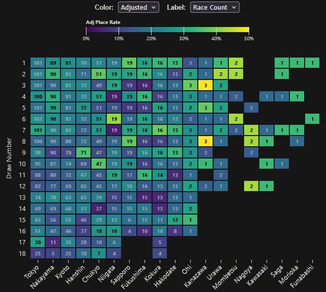
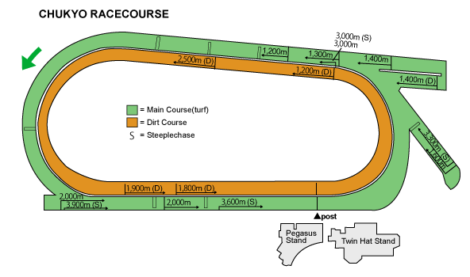
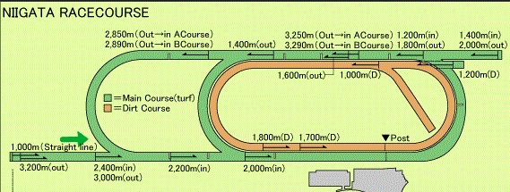
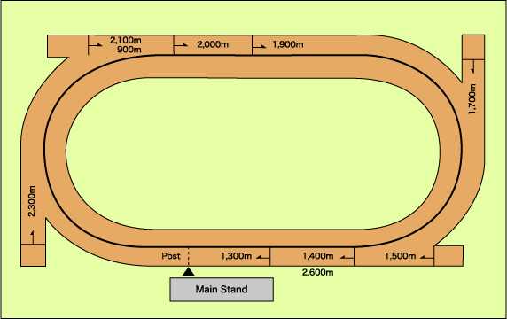

# Discussion: The Impact of Draw Bias
 

## Hypothesis
In horse racing, a critical yet often overlooked factor is the starting position. 
Each slot within the starting gate is referred to as a <strong>"draw"</strong> or stall. 
These stalls are randomly assigned, a gamble which can make or break a race before the gates even open.
A horse drawn on the <strong>inside</strong> (low numbers) runs the shortest distance 
but risks getting "boxed in" behind slower competitors. Conversely, a horse on the <strong>outside</strong> 
(high numbers) enjoys a clear path but is often forced to run wide, covering significantly more ground on the turns.
  
<em>Common racing lore suggests that certain stalls are "cursed" while others are "golden tickets".</em> 
This dashboard tests that theory against the data. Is there a "unicorn" racecourse where the starting position is truly irrelevant? 
Or does the data reveal specific tracks where drawing an "unlucky" number statistically eliminates a horse's chance of winning?

 

## Methods

In particular, I looked at the **Place Rate** (percentage of times a horse finished 1st, 2nd, or 3rd) relative to their starting stall. 

As some tracks have fewer races than others, raw data can be misleading (a horse placing top 3 in the only scraped race at a specific track would show a 100% place rate). To correct for this, I applied Empirical Bayes smoothing to correct for differing sample sizes. I also included context for race count in cases where smoothing seems a bit too optimistic.

## Analysis

### 1. The "Unlucky Unicorn" Exists: Chukyo Racecourse
Gambling is unfortunate

**Chukyo Racecourse** exhibits the most severe penalty for outside runners in the entire dataset. 

* Horses starting from **Draw 14** achieved a Place Rate of only **4.8%** (n=37).
* In a typical 14-16 horse field, random chance would suggest a place rate closer to 18-20%. A 4.8% rate implies that drawing stall 14 at Chukyo is statistically devastating to a horse's chances.

This is likely due to the smaller track configuration at Chukyo. The course features tight spiral turns rather than sweeping corners. The short run-up to the first bend (in sprint distances) combined with these sharp corners forces outside runners to travel significantly more ground, making it difficult to overcome the distance disadvantage against competent opposition.

 

### 2. The "Golden Tickets": Niigata & Kanazawa
Sometimes draws are a boon.

**Niigata (Draw 6):** Shows a massive **41.8%** adjusted place rate. 

This "middle-inside" draw likely offers the perfect balance of saving ground without the risk of getting trapped on the rail.

 

**Kanazawa (Draw 3 & 8):** While the sample size is smaller, the data suggests strong inside bias here as well, with rates exceeding 50%.

### 3. The "Fair" Course: Sapporo
If you are looking for a track where the draw matters least, **Sapporo** appears to be the most balanced.
* **Draw 1 (Inside):** 37.6% Place Rate.
* **Draw 8 (Middle/Wide):** 37.6% Place Rate.

Unlike Chukyo, where the difference between inside and outside is catastrophic, Sapporo allows horses to compete effectively from various starting positions.

 

## Conclusion

The data confirms the common belief, the draw can signifigantly impact a horse's preformance. However, this is extremely track-dependent.

For bettors and analysts, the **Chukyo Outside Draw (12-16)** could be treated as a severe handicap, while the **Niigata Middle Draw (6)** could be an advantage.